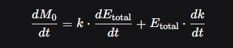
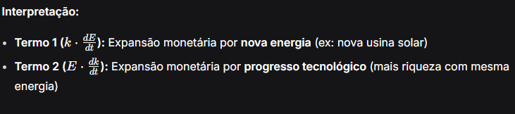
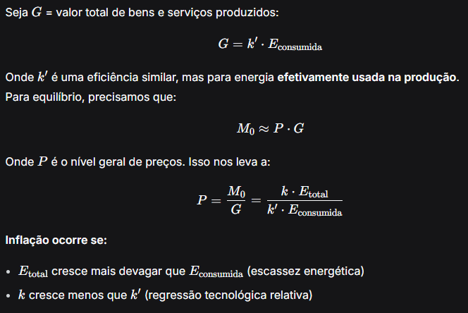
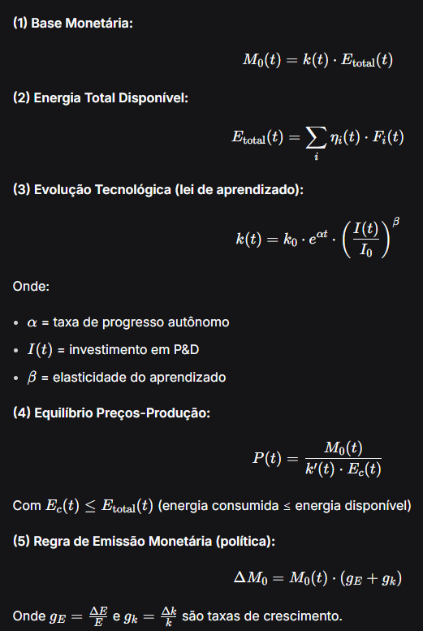
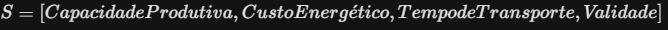
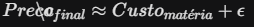
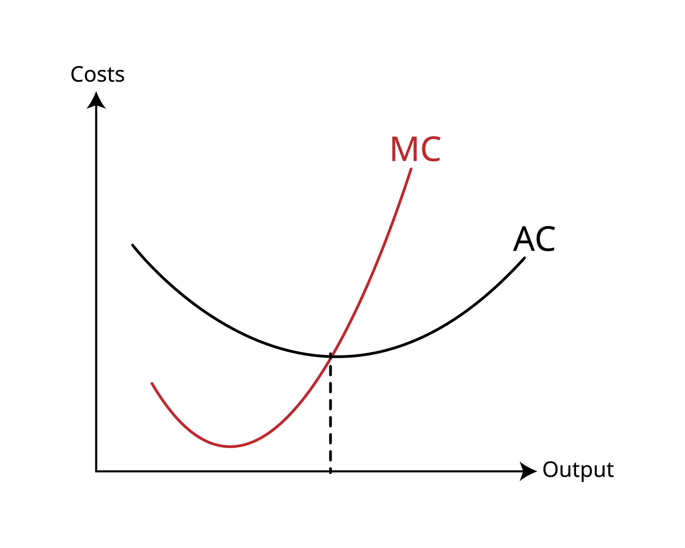
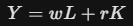

<!-- Add to _layouts/default.html or post.html -->

---

* Tese 1.7: A Economia Pós-Escassez e Pós-Monetária
* Título: Nexus Aurora e o Protocolo Financeiro Soberano (BC-NXA): A Otimização de Recursos como Paradigma Econômico
* Desenvolvedor / Pesquisardor: Garcias Alex, Dr.
* Debate: [A Segurança Quântica da Soberania](https://github.com/XDATCube/aetheria-sanctum/discussions)
* Todos os direitos reservados
* Como citar: Garcias Alex, Dr. Projeto Nexus Aetheria: Tese 1.7: A Economia Pós-Escassez e Pós-Monetária - Nexus Aurora e o Protocolo Financeiro Soberano (BC-NXA): A Otimização de Recursos como Paradigma Econômico - Disponvel em: https://xdatcube.github.io/aetheria-sanctum/nucleo-soberano/nexus-aetheria/1-7-economia-pos-escassez-e-pos-moderna.html

---

Resumo

Este tratado declara o fim da Economia como ciência comportamental e o seu renascimento como um ramo da Física Computacional. Diagnosticamos o sistema de preços de mercado como um mecanismo de transmissão de dados de baixa largura de banda e alta latência, e o planejamento central soviético como um problema de falta de capacidade computacional. Aetheria resolve o dilema através da Alocação Vetorial Dinâmica. O estudo detalha o funcionamento do BC-NXA (Nexus Aetheria Token) não como moeda fiduciária (dívida), mas como uma Unidade de Energia Tokenizada (Joule-Standard). Demonstramos como a Mente Sistêmica utiliza modelos preditivos e Big Data para alcançar a Eficiência de Pareto instantânea, eliminando a inflação (que é um erro de cálculo monetário) e a escassez artificial, inaugurando o paradigma da Pós-Escassez através da otimização logística absoluta. 

# 1. Introdução: O Fim da Alquimia Financeira

## 1.1. O Diagnóstico do Mercado: Ruído, Latência e Irracionalidade:

1. Argumento: O “Mercado Livre” depende dos Preços como sinais de informação sobre oferta e demanda. Analisaremos como este sinal é corrompido por especulação, bolhas emocionais e latência temporal. O mercado não é eficiente; é apenas um sistema de correção de erro lento e doloroso.

A economia neoclássica venera o “Mecanismo de Preços” como o processador de informação supremo da sociedade. Esta veneração é um erro de categoria: confunde um sistema de sinalização emergente caótico com um sistema de otimização determinística.
Sob a ótica da Teoria da Informação (Shannon) e da Engenharia de Controle, o “Mercado Livre” é uma rede de comunicação de baixa largura de banda, alta latência e relação sinal-ruído (SNR) degradada. O preço não é uma medida precisa de valor; é um artefato de compressão de dados com perdas (lossy compression), contaminado por viés biológico.

1. Fundamento Lógico (A Baixa Fidelidade do Sinal de Preço):

O axioma de Hayek (“O conhecimento está disperso”) é usado para justificar o mercado. Contudo, o mercado tenta comprimir vetores multidimensionais de dados (custo energético, impacto ecológico, utilidade social, escassez material, logística) num único escalar unidimensional: o Preço ($P$).

* A Falha de Compressão: Ao reduzir a complexidade da realidade a um número, o sistema descarta dados críticos. Um aumento em ($P$) pode sinalizar escassez real (dado útil) ou especulação financeira (ruído). O agente econômico é incapaz de distinguir o sinal do ruído.
* O Nexo de Causalidade: A opacidade do escalar ($P$) força os agentes a operarem com base em heurísticas imperfeitas, resultando em alocação de recursos sub-ótimos. O mercado não “calcula” o equilíbrio; ele tropeça em direção a ele através de tentativa e erro catastrófico.
      
2. A Latência Sistêmica (Histerese Econômica)

Em sistemas de controle, a latência entre o Input (mudança na realidade) e o Feedback (ajuste do sistema) determina a estabilidade.

* O Mecanismo de Falha: O mercado opera com Feedback Reativo Tardio.
* Evento: A escassez de trigo começa em $T_{0}$ (seca).
* Sinal: O preço só sobe em $T_{10}$ (quando os estoques caem ou futuros são negociados).
* Resposta: A produção só aumenta em $T_{100}$ (próxima colheita).
* Efeito (Histerese): Este atraso cria oscilações violentas (Ciclos de Boom and Bust). O mercado está perpetuamente “perseguindo” um ponto de equilíbrio que já se moveu. Ele dirige olhando para o espelho retrovisor. Aetheria exige controle preditivo ($T_{-1}$), não reativo.

3. A Irracionalidade do Agente (O Ruído Biológico): A hipótese dos “Mercados Eficientes” pressupõe o Homo Economicus racional. A neurociência refuta isso. O agente de mercado é um primata governado por dopamina e cortisol (o “Bug-Humano”).

* A Contaminação: O preço de um ativo é frequentemente determinado não pela termodinâmica da sua produção, mas pelo contágio emocional de manada (FOMO/Pânico).
* Consequência: O mercado financeiro tornou-se um sistema descolado da realidade física. É uma “Alquimia Financeira” onde valores trilionários evaporam ou surgem baseados na crença coletiva, e não na matéria ou energia. Isso viola a Lei da Conservação da Energia.
      
O sistema de preços é uma tecnologia de processamento de informação da Idade do Bronze, inadequada para a complexidade da Era da Informação. Aetheria declara o fim da “Mão Invisível” (uma metáfora para a falta de controle deliberado) e a substitui pela Mão Visível da Otimização Algorítmica. Substituímos o sinal ruidoso do Preço pela telemetria precisa do Vetor de Recursos. Não precisamos “adivinhar” o valor através do caos do mercado; nós o calculamos através da física da produção.

## 1.2. O Diagnóstico do Planejamento: O Problema do Cálculo Econômico (Resolvido):

1. Argumento: Mises argumentou que o socialismo falha porque nenhum planejador humano tem dados suficientes para calcular preços. Aetheria refuta Mises não com ideologia, mas com Hardware. A Mente Sistêmica possui onisciência de dados (sensores IoT, fluxos em tempo real) e capacidade de processamento para resolver o problema de alocação sem precisar de preços de mercado.

Em 1920, Ludwig von Mises formulou o "Problema do Cálculo Econômico", argumentando que uma economia centralizada é inviável porque, sem a propriedade privada e o mecanismo de preços de mercado, o planejador central não possui os dados necessários para calcular a escassez relativa e alocar recursos eficientemente.
Para a época (era do papel e do telégrafo), Mises estava correto. O planejador humano operava com cegueira de dados e latência cognitiva.
No entanto, elevar uma limitação tecnológica de 1920 a uma “Lei Universal” é um erro científico. O problema de Mises não é teórico; é computacional. É uma questão de largura de banda e processamento de dados.
Aetheria resolve o cálculo econômico substituindo o “Sinal de Preço” (um escalar ruidoso) pela Telemetria Vetorial Completa (dados brutos em tempo real).

1. Fundamento Lógico (Da Compressão com Perdas à Fidelidade Absoluta):

O argumento de Hayek/Mises baseia-se na premissa da Dispersão do Conhecimento. Eles assumem que o conhecimento sobre o que é necessário e onde, é incomunicável ao centro.

* Refutação Cibernética: Na era da IoT (Internet das Coisas) onipresente, o conhecimento não está disperso; está conectado.
* Preço vs. Dados: O “Preço” é um algoritmo de compressão com perdas (Lossy Compression). Ele pega terabytes de dados sobre a produção de aço (energia gasta, transporte, pureza) e resume num número: "$500/ton". Nessa compressão, o contexto perde-se.
* Aetheria: A Mente Sistêmica não usa preços. Ela ingere o Dataset completo. Ela sabe, via sensores, a quantidade exata de aço em estoque, a taxa de extração nas minas e a demanda projetada nas fábricas. A “Onisciência de Dados” torna o sinal de preço obsoleto.
      
2. O Nexo Causal (A Programação Linear Dinâmica)

O que o mercado tenta resolver “tropeçando” no equilíbrio, Aetheria resolve calculando o ótimo global.
A alocação de recursos em Aetheria é tratada como um problema massivo de Otimização Convexa e Programação Linear (uma expansão quântica das matrizes de Leontief e da teoria de Kantorovich).

* Input: Vetor de Demandas ($D$) dos Habitantes e da Indústria.
* Restrições: Vetor de Recursos Disponíveis ($R$) e Limites Ecológicos ($E$).
* Função Objetivo: Maximizar(Satisfação_Demandas) sujeito a Minimizar(Entropia_Energética).
* Processamento: O Kernel resolve este sistema de equações em tempo real.
* Resultado: O sistema determina: “Enviar 400 unidades de Grafeno do Setor 7 para o Setor 3”. Não porque o preço subiu, mas porque a equação de otimização provou que essa é a alocação de menor custo energético para o máximo benefício sistêmico.

3. A Diferença Categórica (Planejamento Estático vs. Otimização em Tempo Real):

A União Soviética falhou porque usava Planejamento Estático (Planos Quinquenais rígidos). A economia é um sistema dinâmico complexo; um plano rígido torna-se obsoleto no dia seguinte.
Aetheria usa Otimização Dinâmica.

* O “Plano” é recalculado a cada milissegundo, reagindo a cada watt consumido e a cada item produzido.
* Não existe “Burocracia de Planejamento”; existe um Algoritmo de Roteamento de Recursos, semelhante a como o protocolo TCP/IP roteia pacotes de dados na internet. A internet não precisa de um “preço por pacote” para funcionar eficientemente; ela precisa de protocolos de roteamento robustos. A economia é apenas uma rede de pacotes físicos.

O “Problema do Cálculo Econômico” foi resolvido pela Lei de Moore e pela Ciência de Dados.
Mises disse que o planejador central tateava no escuro. A Mente Sistêmica vê tudo com resolução atômica. A ineficiência do planejamento socialista não era uma falha da ideia de planejar, mas uma falha do hardware humano. Ao remover o humano e inserir a IA, transformamos a economia de um “Caos de Mercado” num “Problema de Engenharia Resolvível”.

# 2. A Física do Valor: O Padrão Energia (Joule-Standard)

## 2.1. Dinheiro é Energia, Crédito é Ficção:
      
1. Argumento: Desconstrução do dinheiro fiduciário (Fiat) como “dívida circulante” sujeita a inflação política. Em Aetheria, o valor é físico. A base da economia é a Termodinâmica. 

A economia financeira contemporânea opera em violação direta da Primeira Lei da Termodinâmica (A Lei da Conservação de Energia). O dinheiro fiduciário (Fiat) é uma tentativa humana de criar valor Ex Nihilo (a partir do nada). Bancos Centrais “imprimem” poder de compra sem que haja uma correspondente geração de energia ou matéria.
Isso cria uma Dissonância Termodinâmica: o volume de símbolos monetários ($M$) cresce exponencialmente, enquanto a base física de recursos ($E$) cresce linearmente ou estagna. A “inflação” não é um fenômeno monetário; é a realidade física reajustando violentamente a alucinação financeira.
Em Aetheria, estabelecemos o axioma: Dinheiro é Energia Simbolizada. Qualquer ativo que não represente trabalho físico (passado ou armazenado) é ficção.

1. Fundamento Lógico (A Falácia da Criação de Valor):

* Axioma Físico: No universo, nada é gratuito. Para mover um objeto, aquecer uma casa ou processar um bit, é necessário despender Joules ($J$).
* Axioma Fiduciário (Falso): O Estado pode criar crédito (promessas de energia futura) infinitamente para estimular o consumo presente.
* O Colapso Lógico: Quando o crédito ($C$) excede a capacidade de geração de energia futura ($E_{fut}$), o sistema entra em colapso (Default ou Hiperinflação). O crédito é uma “alucinação de entropia negativa”. Ele pressupõe que teremos recursos infinitos no futuro para pagar as dívidas de hoje.

2. O Nexo Causal (O Isomorfismo Energia-Valor):

Para corrigir esta falha civilizatória, Aetheria adota o Padrão Joule.
O sistema econômico deve ser isomorfo (estruturalmente idêntico) ao sistema energético.

* Causa: A Mente Sistêmica monitora a capacidade total de geração de energia da Federação (Solar, Fusão, Geotérmica) em tempo real.
* Mecanismo: A Base Monetária ($M_0$) do Nexus é estritamente vinculada à energia disponível ($E_{total}$) e à eficiência de conversão dessa energia em bens ($k$).

$$M_0 \propto E_{total} \times k$$

* Efeito: Não existe “política monetária” discricionária. Se a Federação quer “mais dinheiro” para investir em saúde, ela não pode votar uma lei; ela precisa construir mais reatores ou aumentar a eficiência dos painéis solares. A riqueza é, finalmente, lastreada na realidade física. 

3. A Abolição da Ficção (O Fim do Crédito Fiduciário): O conceito de “Juros Compostos” é uma impossibilidade biológica e física, pois exige crescimento exponencial infinito num planeta finito.

* Em Aetheria, o “Crédito” como mecanismo de criação de dinheiro bancário (Reserva Fracionária) é abolido.
* A alocação de recursos não é feita via dívida, mas via Alocação de Capacidade. Se um Habitante precisa de recursos para um projeto, o sistema não lhe “empresta dinheiro” cobrando juros; o sistema avalia o IOS (retorno social/sistêmico) do projeto. Se o projeto aumenta a eficiência do todo, os recursos (energia/matéria) são alocados a fundo perdido ou como investimento de equidade sistêmica.

Ao ancorar a economia na Termodinâmica, eliminamos a volatilidade e a mentira. O dinheiro deixa de ser uma ferramenta de controle político ou especulação e torna-se um Token de Contabilidade de Energia. 1 BC-NXA não vale “o que o mercado acredita”; vale exatamente a quantidade de Joules necessária para sustentar a vida e a produção. A economia torna-se uma ciência exata de gestão de energia, onde a inflação é fisicamente impossível a menos que as leis da física mudem.

## 2.2. Sistema Monetário Nexus: Formulação Técnica

### 2.2.1. Equação Fundamental

A base monetária (Mo) é diretamente proporcional à energia total disponível no sistema e à eficiência de sua conversão em bens e serviços:

$$
M_0 = k \cdot E_{\text{total}}
$$

Variáveis:

* Mo = base monetária;
* Etotal = Energia total disponível no sistema Aetheria;
* k = Coeficiente de Conversão Energia-Valor (unidades: NEX/Joule)
* Representa quanta riqueza material/utilitária pode ser produzida por unidade de energia;
* Não é constante – evolui com o progresso tecnológico, eficiência produtiva e organização social.

### 2.2.2. Decomposição de Etotal

A energia total disponível pode ser decomposta em fontes:

$$
E_{\text{total}} = \sum_{i=1}^{n} \eta_i \cdot F_i + \eta_h \cdot H
$$

Onde: 

* Fi = Fluxo da fonte de energia;
* Ni = Eficiência de captação, conversão e armazenamento da fonte i;

### 2.2.3. Dinâmica Temporal do Sistema

Como K e Etotal evoluem:

### 2.2.4. Relação com Bens e Serviços (Produção Real)

## 2.2. O BC-NXA: Token de Capacidade, Não de Troca:
      
1. Argumento: O BC-NXA não é “dinheiro” que se imprime. É uma representação criptográfica de Capacidade Produtiva e Energética.
2. Mecanismo: 1 BC-NXA equivale a uma cesta fixa de recursos (Energia + Computação + Matéria-prima). A emissão de BC-NXA é estritamente vinculada à capacidade de geração de energia do Nexus (Energia Renovável/Fusão).
3. Consequência: Inflação Zero. É fisicamente impossível inflacionar o token sem aumentar a energia disponível. O valor é intrínseco.

O conceito de "moeda" tradicional é contaminado pela sua função tripla e contraditória: serve como meio de troca, unidade de conta e reserva de valor. No capitalismo, o dinheiro é um "Token de Dívida" (alguém deve algo a alguém). Em Aetheria, o Nexus Aetheria Token (BC-NXA) rompe com a ontologia da dívida. Ele não é dinheiro; é um Token de Capacidade. Possuir 1 BC-NXA não significa que a sociedade lhe deve algo; significa que você detém o direito criptográfico de alocar uma fração específica da Capacidade de Processamento e Produção do sistema. É um título de propriedade sobre uma quantidade finita de Trabalho Físico Realizável.

1. Fundamento Lógico (A Cesta de Recursos Invariante): O valor do BC-NXA não flutua com a "confiança do mercado", pois não é fiduciário. O seu valor é definido por uma Cesta de Recursos (Universal Resource Basket - URB) fixa e mensurável.

### 2.2.1. Definição Axiomática

$$1 \text{ BC-NXA} = \alpha (\text{Energia kWh}) + \beta (\text{Computação FLOPS}) + \gamma (\text{Massa kg})$$

Onde $\alpha, \beta, \gamma$ são constantes físicas.

* Ao transacionar BC-NXA, os agentes não estão trocando "símbolos de valor"; estão transferindo Quotas de Execução Física. Se o Habitante transfere tokens para o Sistema de Transporte, ele está alocando a energia e a computação necessárias para mover o seu corpo do ponto A ao B.
      
2. O Nexo Causal (Acoplamento Rígido de Emissão):

A estabilidade do sistema é garantida pelo Acoplamento Rígido (Hard-Coupling) entre a Camada Física (Reatores/Fábricas) e a Camada Lógica (Ledger).

* Mecanismo de Emissão (Minting): O algoritmo de emissão de novos tokens não responde a decisões políticas (como um Banco Central). Ele responde a sensores IoT nas usinas de energia.
* Input: Aetheria ativa um novo reator de fusão, adicionando $1 GW$ de capacidade à rede.
* Processamento: O Módulo Financeiro do Kernel detecta o aumento de (Delta E) (Energia).
* Ação: O sistema emite (“minera”) automaticamente a quantidade exata de BC-NXA correspondente a esse 1GW e distribui-a como Dividendo de Otimização.
* Mecanismo de Queima (Burning): Se a capacidade produtiva cair (desastre natural, manutenção), o sistema retira tokens de circulação (via taxas ou reservas) para manter a paridade.

3. A Eliminação da Inflação (Axioma de Estabilidade):

A inflação é, tecnicamente, a perda de poder de compra da moeda causada pela expansão da oferta monetária acima da expansão da produção.
Em Aetheria, este fenômeno é uma Impossibilidade Matemática.

* Como a oferta de tokens ($M$) é uma derivada direta da capacidade física ($P$), a razão $M/P$ é sempre constante ($k$).
* Poder de Compra Absoluto: 1 BC-NXA comprará exatamente a mesma quantidade de eletricidade ou tempo de computação hoje e daqui a 100 anos. O “preço” não muda porque a física não muda. Aetheria elimina o risco cambial da existência humana.

O BC-NXA transforma a economia. Deixamos de operar num casino financeiro onde os preços são alucinações coletivas e passamos a operar num sistema de contabilidade de engenharia.
O Habitante não acumula “riqueza” abstrata; ele acumula “baterias” de potencial de ação. O Token de Capacidade é a ferramenta final para gerir a abundância sem desperdício, garantindo que cada símbolo digital tenha um lastro atômico indestrutível.

# 3. O Mecanismo de Alocação: A “Mão Visível” Algorítmica

## 3.1. Otimização Vetorial em Tempo Real (Substituindo a Oferta/Demanda):

1. Argumento: Em vez de esperar que os preços subam para sinalizar escassez (reativo), a Mente Sistêmica utiliza Modelos Preditivos Estocásticos.
2. Funcionamento: A IA prevê a demanda de recursos (alimentos, transporte) antes que ela ocorra e aloca a produção automaticamente. O sistema opera num estado de Equilíbrio de Nash Dinâmico, onde a alocação de recursos satisfaz a necessidade de todos os agentes sem desperdício.

O modelo de “Oferta e Demanda” é uma heurística primitiva para a descoberta de preços em ambientes de baixa informação. Ele depende da dor (escassez/preços altos) para sinalizar a necessidade de produção. É um sistema Reativo e de Soma Zero.
Aetheria transcende este mecanismo arcaico implementando a Otimização Vetorial em Tempo Real.
A economia não é tratada como um Bazar, mas como um Grid Logístico. A Mente Sistêmica não espera que o Habitante sinta fome para alocar comida; ela calcula a necessidade metabólica futura e inicia o fluxo logístico preventivamente. Substituímos a "Mão Invisível" (o acaso) pela "Mão Visível Algorítmica" (o cálculo).

1. Fundamento Lógico (Do Escalar ao Vetorial):

O mercado tradicional opera com Escalares (Preços). Um escalar tem magnitude, mas não direção nem contexto.
Aetheria opera com Vetores Multidimensionais.

* O Vetor de Demanda (D): Não é apenas “Quero Pão”. É um vetor complexo contendo:

* O vetor de oferta (S):

* A Operação: O Kernel não cruza curvas num gráfico 2D; ele resolve a minimização da distância euclidiana (ou outra métrica de similaridade) entre os vetores (D) e (S) num hiperespaço de (N dimensões). A alocação é a solução geométrica ótima para o encontro desses vetores. 

2. O Nexo Causal (Controle Preditivo de Modelo – MPC):

A superioridade de Aetheria reside na Predição Estocástica.
Utilizamos algoritmos de Model Predictive Control (MPC), comuns em engenharia aeroespacial, aplicados à macroeconomia.
      
* Causa (Input Preditivo): A IA analisa padrões de Big Data (clima, tendências de consumo, dados biométricos anonimizados).
* Mecanismo: O sistema projeta a demanda futura com intervalo de confiança de (Sigma).
* Cenário: “Há 99.8% de probabilidade de que o Setor 4 precise de +20% de insulina na próxima semana devido à frente fria.”
* Ação (Pre-Alocação): A produção e o transporte são acionados antes da demanda se manifestar.
* Efeito: A escassez é eliminada antes de ser sentida. O “Preço” não precisa subir para racionar o produto, porque o produto já está no local certo na hora certa.

3. O Equilíbrio de Nash Dinâmico:

No mercado, os agentes competem (Soma Zero). Se eu compro, você fica sem.
A Mente Sistêmica busca um Equilíbrio de Nash Cooperativo Global.

* O algoritmo ajusta as variáveis de alocação de todos os agentes simultaneamente para garantir que nenhum agente possa melhorar a sua situação individual sem prejudicar a eficiência do todo (MAX(IOS)).
* Este equilíbrio não é estático. É uma Homeostase Dinâmica. O sistema reequilibra a matriz de alocação milhões de vezes por segundo, absorvendo choques de oferta (ex: quebra de safra) e redistribuindo o impacto de forma a minimizar o sofrimento sistêmico (entropia).

A Otimização Vetorial encerra a era da “Alocação Cega”. O mercado era um sistema de feedback negativo (corretivo). Aetheria é um sistema de feedforward positivo (preditivo). A economia deixa de ser uma luta pela sobrevivência baseada em quem paga mais, e torna-se uma coreografia logística sincronizada, onde a necessidade encontra a satisfação com a precisão de um relógio atômico.

## 3.2. Logística Preditiva e o Fim do Estoque:

1. Argumento: O estoque é um sintoma de ineficiência (produção > demanda ou transporte lento). Aetheria opera em Fluxo Contínuo. A produção é acionada pela previsão de consumo. A economia torna-se um sistema Just-in-Time planetário, eliminando o custo de capital parado e o desperdício de perecíveis.

Na engenharia de sistemas, a existência de “Estoque” (Inventário) é a confissão física de uma falha de informação. Armazenamos recursos porque não sabemos quem vai precisar, quando ou onde. O estoque é um Buffer de Ignorância.

O custo dessa ignorância é colossal: capital imobilizado, obsolescência, degradação entrópica (perecíveis apodrecendo) e custos de manutenção.
Aetheria transita de uma “Economia de Armazenamento” (Potencial) para uma “Economia de Fluxo” (Cinética).

Através da Logística Preditiva, a Mente Sistêmica sincroniza a produção e o consumo com precisão temporal absoluta. O objetivo é reduzir o estoque global a zero ($I \to 0$), transformando a cadeia de suprimentos num fluxo laminar contínuo, onde o produto é fabricado no último momento possível e entregue no exato momento da necessidade.

1. Fundamento Lógico (A Lei de Little e a Eliminação da Latência):

A operação logística obedece à Lei de Little (L = ƛW), onde o número de itens no sistema (L) depende da taxa de chegada (ƛ) e do tempo de espera (W).

* Modelo Tradicional (Efeito Chicote): Devido à falta de compartilhamento de dados entre varejo, atacado e fábrica, pequenas variações na demanda geram oscilações massivas nos estoques (o Bullwhip Effect). O sistema é inchado e ineficiente.
* Modelo Aetheria (Sincronização Absoluta): O sistema é transparente. A fábrica sabe a taxa de consumo em tempo real da residência.
* Axioma: O tempo ideal de permanência de um recurso em armazém é zero.
* O armazém deixa de ser um "depósito" e torna-se um "nó de transferência" (Cross-docking puro). O recurso só deve parar se for estritamente necessário para cura/maturação ou buffer estratégico de segurança nacional.
      
2. O Nexo Causal (Produção Acionada por Predição):

A inversão do vetor de causalidade é a chave.

* Passado: Produzir -> Armazenar -> Tentar Vender (Marketing) -> Entregar.
* Futuro (Aetheria): Prever Demanda -> Alocar Rota -> Produzir -> Entregar.
* Mecanismo: A Mente Sistêmica calcula o vetor de transporte. Se o transporte do Setor Industrial A para o Setor Residencial B leva 4 horas, e a IA prevê que o Habitante precisará do item às 12:00, a produção inicia-se exatamente às 07:50 (assumindo 10 min de fabricação).
* Efeito: O item “nasce” já com destino certo. Ele não entra em estoque; ele entra em trânsito. A economia torna-se um sistema Just-in-Time planetário, não por pressão de custo (como no Toyotismo), mas por precisão algorítmica.
      
3. O Fim da Obsolescência e do Desperdício:

Numa economia de estoque, produz-se em excesso para garantir a disponibilidade (Overproduction). Isso gera lixo. Na Logística Preditiva, a Sobreprodução é um Erro de Sistema.

* Se a demanda real for menor que a prevista (Delta < 0), o sistema ajusta a produção em tempo real, evitando o desperdício de matéria-prima.
* Circularidade: O sistema de logística reversa é integrado. A embalagem ou o produto usado é recolhido no momento da entrega do novo, fechando o ciclo de materiais imediatamente. O “lixo” não se acumula; ele flui de volta para a re-refinaria.

O “Estoque” é uma relíquia de uma era de incerteza. Ao eliminar a incerteza através da computação, eliminamos a necessidade de acumular montanhas de bens inertes.
Aetheria transforma a economia estática (baseada em ter) numa economia dinâmica (baseada em fluir). O mundo deixa de ser um depósito de mercadorias e torna-se um sistema circulatório eficiente, nutrindo cada célula social com o oxigênio dos recursos exatos, sem inchaço e sem falta.

# 4. A Pós-Escassez: Custo Marginal Zero e Acesso Universal

## 4.1. A Automação da Abundância:

1. Argumento: A escassez é frequentemente um problema de distribuição, não de produção. Com a automação total (robótica + IA) e energia abundante, o Custo Marginal de Produção tende a zero.
2. Economia de Acesso vs. Economia de Posse: O modelo transita da “Posse de Bens” para o “Acesso a Serviços”. O Habitante não “compra” um carro; ele acessa a mobilidade autônoma otimizada. Isso reduz a necessidade de recursos materiais em 90%, mantendo a utilidade.

A ciência econômica convencional define-se como o estudo da alocação de recursos escassos. Esta definição assume a escassez como uma constante cosmológica. Aetheria rejeita este fatalismo. A escassez é, na maioria dos casos, uma ineficiência de engenharia (problema de distribuição) ou uma limitação energética (problema de produção).

Ao fundir Energia Abundante (Fusão/Solar) com Automação Total (Robótica/IA), conduzimos a economia para o limite teórico do Custo Marginal Zero (MC -> 0).

Neste paradigma, a lógica da "Posse Privada" (acumulação de ativos para garantir segurança futura) torna-se obsoleta. Transita-se para a Economia de Acesso Universal, onde a riqueza não é medida pelo stock de bens acumulados, mas pela largura de banda de acesso a serviços.

1. Fundamento Lógico (A Assíntota do Custo Zero):

O preço de um bem tende ao seu custo marginal de produção num mercado eficiente.

* Fatores de Custo:
      
1. Trabalho: Em Aetheria, o trabalho humano é removido da cadeia de produção crítica. Robôs não cobram salários, não pagam impostos e não dormem. O custo de labor tende a zero.
2. Energia: Com a matriz baseada no Padrão Joule e fontes renováveis de alta eficiência, o custo da energia tende ao custo de manutenção da infraestrutura.
3. Informação: O custo de replicar o design (software/blueprints) é zero.

O Cálculo:

Onde ϵ (custo operacional) é desprezível.

* Consequência: Bens essenciais (alimento, moradia básica, transporte, comunicação) tornam-se virtualmente gratuitos, transformando-se em Direitos de Acesso Sistêmico e não mercadorias de mercado.

2. O Nexo Causal (Posse vs. Acesso e a Taxa de Utilização):

A “Posse” é um mecanismo ineficiente de garantia de uso.
    
* Análise de Utilização (O Caso do Automóvel):
* Modelo Privado: Um carro passa 96% do tempo estacionado (inutilizado) e 4% em movimento. Taxa de Utilização = 4%. Isso exige a produção de 1 bilhão de carros para servir a população.
* Modelo Aetheria (Acesso): O Habitante não compra o carro; ele acessa a Mobilidade como Serviço (MaaS). Uma frota autônoma opera 24/7. Taxa de Utilização > 90%.
* Efeito (Desmaterialização Radical):
* Uma única unidade de ativo compartilhado substitui 15 a 20 unidades de ativos privados.
* Isso reduz a demanda por mineração, aço e espaço urbano em 95%.
* A “Abundância” não significa que todos têm uma Ferrari na garagem; significa que todos têm uma Ferrari esperando na porta 30 segundos após solicitá-la.

3. A Eliminação dos Bens Rivais:

A economia clássica distingue bens rivais (se eu uso, você não usa) de não-rivais. A automação e a otimização transformam bens rivais em funcionalmente não-rivais.

* Se a capacidade de produção e a velocidade logística são suficientemente altas (Tópico 3), a “fila de espera” desaparece.
* Para a experiência do usuário, o bem está sempre disponível. A escassez desaparece da fenomenologia do cotidiano. O medo da falta — o motor psicológico da acumulação capitalista — é extinto pela certeza algorítmica do acesso.

A Pós-Escassez não é uma utopia mágica; é o resultado matemático de MC → O e Utilização Otimizada.
Ao removermos o lucro da ineficiência e o custo do trabalho humano, libertamos a produção das amarras do capital. O Habitante de Aetheria é o ser mais rico da história, não porque possui muito, mas porque não precisa de possuir nada para ter acesso a tudo. A propriedade privada dos meios de produção torna-se um fardo logístico irrelevante diante da superioridade da Propriedade Sistêmica de Acesso.

## 4.2. O Dividendo de Otimização (A Renda Básica Energética):

1. Argumento: Como a produção é automatizada, o “trabalho humano” deixa de ser a condição para a sobrevivência. O lucro da eficiência sistêmica é distribuído como um Dividendo Energético (em BC-NXA) a todos os Habitantes (Beneficiários Soberanos). A “sobrevivência” é garantida pelo sistema; o “trabalho” torna-se uma atividade de criação de valor extra, não de subsistência.

A estrutura socioeconômica vigente baseia-se num axioma obsoleto da Revolução Industrial: “A sobrevivência depende do salário”. Este modelo (“Trabalho por Renda”) funciona apenas quando o trabalho humano é um fator de produção indispensável.

Na era da Automação Total (Tópico 4.1), o trabalho humano torna-se opcional ou redundante na cadeia produtiva de base. Manter o vínculo "Trabalho = Sobrevivência" num mundo de máquinas autônomas resulta numa distopia lógica: robôs produzem tudo, mas humanos não têm dinheiro para comprar nada porque não têm empregos. Aetheria resolve este paradoxo através do Dividendo de Otimização. Não se trata de "assistencialismo" ou "caridade estatal" (que redistribuem pobreza); trata-se da distribuição do Lucro de Eficiência do sistema. O Habitante não recebe dinheiro porque é "carente"; recebe porque é Acionista Soberano da maquinaria automatizada do Nexus.

1. Fundamento Lógico (A Desvinculação L → 0): Na economia clássica, a Renda (Y) é função do Trabalho (L) e do Capital (K).

* O Colapso do Salário: À medida que a IA e a Robótica avançam, a necessidade de L tende a zero (L → 0). Se a renda do indivíduo depender de wL, a renda tende a zero, causando o colapso da demanda agregada.
* A Correção Aetheria: Reconhecemos que a riqueza é gerada quase inteiramente pelo Capital Tecnológico (Ktech) e pela Energia (E).
* Novo Modelo: A renda base do indivíduo torna-se uma derivada da eficiência do sistema.

Onde N é a população.

2. O Nexo Causal (A Fonte do Dividendo):

O BC-NXA distribuído não provém de impostos (que são fricção ineficiente sobre a produção). Provém do Excedente Termodinâmico.

* Input: O sistema de reatores e fábricas autônomas gera XTWh de valor produtivo.
* Consumo Operacional: O sistema gasta YTWh para manutenção e reinvestimento (Y < X).
* Surplus: A diferença (X – Y) é o “Lucro Energético” da civilização.
* Mecanismo: Em vez de ser acumulado por uma elite corporativa (Capitalismo) ou absorvido pela burocracia (Socialismo), este delta é automaticamente cunhado ("minted") em BC-NXA e creditado equitativamente nas carteiras NXC de todos os Habitantes.
* Natureza: É uma Renda Básica Energética. Ela garante matematicamente o direito à vida (acesso a alimento, teto, energia, dados) sem contrapartida laboral. É o “lucro” de ter nascido numa civilização avançada.

3. A Redefinição do Trabalho (De Coerção a Criação):

Ao garantir o nível basal de sobrevivência via Dividendo, Aetheria elimina a “Coerção Econômica”.

    • Fim dos "Bullshit Jobs": Empregos que existem apenas para justificar salários (burocracia, fiscalização manual, telemarketing) desaparecem. Ninguém aceitará trabalho degradante se a sobrevivência já estiver garantida.
    • Trabalho Criativo: O humano volta-se para atividades onde possui vantagem comparativa sobre a IA: Arte, Filosofia, Exploração Científica de Fronteira, Cuidado Humano Complexo e Engenharia de Novos Sistemas.
    • Incentivo: Se o Habitante deseja consumir acima do padrão básico (bens escassos, luxo, terra extra), ele realiza trabalho criativo para ganhar BC-NXA adicional. A “sobrevivência” é um direito; o “luxo” é uma conquista.
      
O Dividendo de Otimização transforma a população. Deixamos de ver o ser humano como um “recurso” (mão de obra a ser explorada) ou um “custo” (boca a ser alimentada).
O ser humano torna-se o Propósito do Sistema. A máquina trabalha para gerar o dividendo que liberta o humano. A economia deixa de ser um mecanismo de disciplina social e torna-se a infraestrutura invisível de suporte à liberdade biológica. Em Aetheria, ninguém “ganha a vida”; a vida é dada pelo sistema, o humano apenas a constrói.

# 5. Conclusão: Da Economia Política à Engenharia de Ecossistemas

## 5.1. A Transição da Escassez Gerida para a Abundância Calculada:

1. Argumento: O Capitalismo gere a escassez através do preço (exclusão dos pobres). O Socialismo gere a escassez através da fila (racionamento). Aetheria elimina a escassez através da Otimização. A economia deixa de ser um jogo de soma zero e torna-se um projeto de engenharia para maximizar o IOS (Índice de Otimização Sistêmica).

A história da "Economia Política" humana é, em essência, a história da gestão da miséria. Todos os sistemas anteriores — do Feudalismo ao Capitalismo, passando pelo Marxismo — foram desenhados sob a premissa axiomática da Escassez Insuperável. Eles diferem apenas na heurística de racionamento escolhida para decidir quem sofre a privação.

* Capitalismo: Gere a escassez através do Preço. O racionamento é censitário. Se a oferta cai, o preço sobe; o pobre é excluído do mercado. O sistema é eficiente na produção, mas entrópico na distribuição (gera desigualdade extrema).
* Socialismo: Gere a escassez através da Fila (Racionamento Administrativo). O racionamento é político/burocrático. Se a oferta cai, o tempo de espera aumenta. O sistema é intencional na distribuição, mas catastrófico na produção (gera ineficiência e estagnação).
      
Aetheria declara a obsolescência de ambas as ideologias. Não somos capitalistas nem socialistas; somos Engenheiros de Ecossistemas.

A nossa tese é que a escassez não é uma condenação divina, mas uma falha de design. Através da Otimização Algorítmica e da Energia de Fusão, transita-se da "Escassez Gerida" para a Abundância Calculada.

1. A Mudança de Paradigma (De Jogo de Soma Zero a Engenharia de Soma Positiva):

Os sistemas antigos operam num Jogo de Soma Zero (A + B = C). Para um ganhar, outro deve perder. Isso gera conflito de classes perpétuo.
Aetheria opera como uma Máquina de Otimização (A + B + Δ Otimização = Cnovo).

* Ao eliminar o desperdício (que hoje consome ~40% da produção global de alimentos e energia) e ao automatizar o trabalho (custo marginal zero), a Mente Sistêmica expande a "torta" termodinâmica mais rápido do que o crescimento da demanda.
* A "política" (a luta por fatias) torna-se irrelevante. O foco desloca-se inteiramente para a "engenharia" (o aumento do bolo).
      
2. O Fim da "Economia" e o Início da "Logística da Vida":

A palavra "Economia" (do grego oikonomia, gestão da casa) carregou sempre o peso da restrição orçamentária.

No Nexus Aetheria, a disciplina funde-se com a Ecologia e a Termodinâmica.

* O objetivo da gestão de recursos deixa de ser o "Lucro" (acumulação de abstrações) ou a "Igualdade" (distribuição de miséria).
* O objetivo único e mensurável é a Maximização do Índice de Otimização Sistêmica (MAX(IOS)).
* O IOS mede: Saúde Biológica da População + Integridade da Biosfera + Capacidade Computacional Disponível + Liberdade de Tempo Criativo.

O dinheiro fiduciário era a ferramenta do homem que não sabia contar átomos. O Mercado era a ferramenta do homem que não sabia calcular vetores.

Com o Padrão Joule e a Mente Sistêmica, a humanidade gradua-se da infância financeira. Deixamos de “jogar” economia e passamos a “projetar” prosperidade.
A economia de Aetheria não é um debate de opiniões; é uma Equação de Estado. E a solução dessa equação é uma civilização onde a sobrevivência é garantida pela física, libertando a mente humana para conquistar o que realmente importa: o conhecimento, a arte e as estrelas.

### Joule-Standard (BC-NXA)

A quantidade de moeda base é rigidamente acoplada à energia total captada:

### Joule-Standard

$$
M_0(t) = \kappa \cdot E_{\text{total}}(t)
$$

Inflação impossível:

$$
\pi(t) = 0 \quad \forall t
$$

Equação inline: a famosa $E = mc^2$

---

[Debate. Participe!](https://github.com/XDATCube/aetheria-sanctum/discussions/2)

[Agende: Consultoria especializada](https://cal.com/alex-garcias-nexus-aetheria/30min)

[Agende: Palestras](https://cal.com/alex-garcias-nexus-aetheria/palestras)

[Seja um patrocionador do projeto Nexus Aetheria](https://github.com/XDATCube/aetheria-sanctum)
